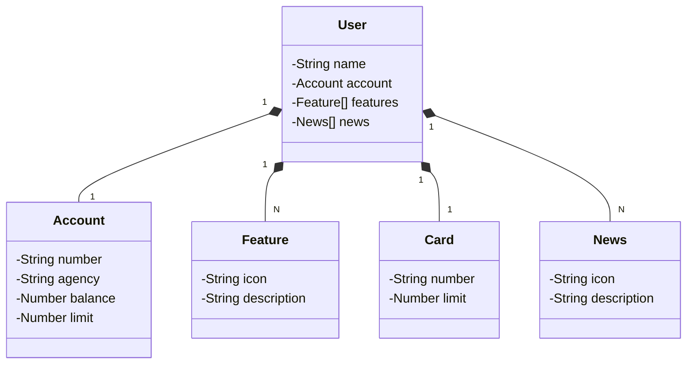

# spring-boot-rest-api
 
Desafio [DIO](https://dio.me) sobre a criação de uma API REST na núvem com Spring Boot 3, Java 17 e Railway

Projeto parte do [Desafio de Código](https://web.dio.me/project/publicando-sua-api-rest-na-nuvem-usando-spring-boot-3-java-17-e-railway/learning/138c435a-5be5-450b-a292-cf6ea002f54c](https://web.dio.me/project/publicando-sua-api-rest-na-nuvem-usando-spring-boot-3-java-17-e-railway/learning/138c435a-5be5-450b-a292-cf6ea002f54c?back=/track/santander-bootcamp-2023-fullstack-java-angular&tab=path&moduleId=undefined)https://web.dio.me/project/publicando-sua-api-rest-na-nuvem-usando-spring-boot-3-java-17-e-railway/learning/138c435a-5be5-450b-a292-cf6ea002f54c?back=/track/santander-bootcamp-2023-fullstack-java-angular&tab=path&moduleId=undefined) do Bootcamp Santander FullStack Java + Angular

## Rodando o projeto localmente
Primeiro defina uma variável de ambiente em sua IDE preferida:
`"SPRING_PROFILES_ACTIVE": "dev"`

Usando o VS Code, após clonar o projeto e rodar a primeira vez, terá a pasta .vscode e o arquivo launch.json

dentro do `launch.json` insira a variável de ambiente da seguinte forma:

```json
"configurations": [
    {
        ...
        "env": {
            "SPRING_PROFILES_ACTIVE": "dev"
        }
    }
]
```

Agora o projeto está pronto para rodar em ambiente de desenvolvimento, utilizando o H2 DB.

Rode o projeto pela Classe Application em `src/main/java/com/pregobs/springbootrestapi/Application.java`

Acesse no navegador `http://localhost:8080`

Para acessar o console do banco de dados: `http://localhost:8080/h2-console`. As credenciais estão em `src/main/resources/application-dev.yml`

Para acessar o Swagger UI e testar a API: `http://localhost:8080/swagger-ui.html`

## Diagrama de Classes

