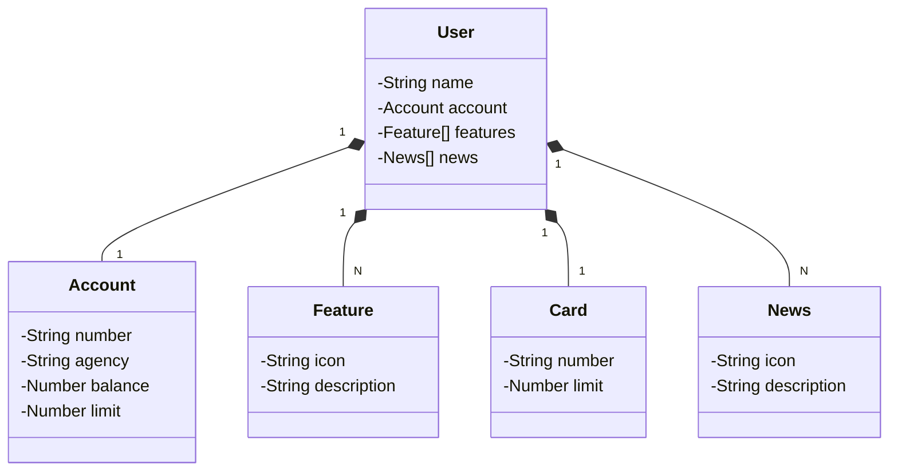

# spring-boot-rest-api
 
Desafio [DIO](https://dio.me) sobre a criação de uma API REST na núvem com Spring Boot 3, Java 17 e Railway

Projeto parte do [Desafio de Código](https://web.dio.me/project/publicando-sua-api-rest-na-nuvem-usando-spring-boot-3-java-17-e-railway/learning/138c435a-5be5-450b-a292-cf6ea002f54c](https://web.dio.me/project/publicando-sua-api-rest-na-nuvem-usando-spring-boot-3-java-17-e-railway/learning/138c435a-5be5-450b-a292-cf6ea002f54c?back=/track/santander-bootcamp-2023-fullstack-java-angular&tab=path&moduleId=undefined)https://web.dio.me/project/publicando-sua-api-rest-na-nuvem-usando-spring-boot-3-java-17-e-railway/learning/138c435a-5be5-450b-a292-cf6ea002f54c?back=/track/santander-bootcamp-2023-fullstack-java-angular&tab=path&moduleId=undefined) do Bootcamp Santander FullStack Java + Angular

## Diagrama de Classes

